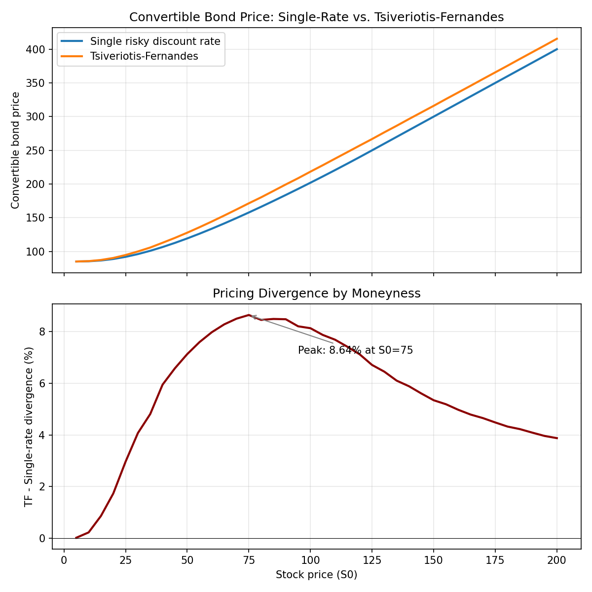

# Convertible Bond Credit Treatment under State-Dependent Conversion Risk

A research project examining when credit-risk treatment actually matters in
convertible bond pricing: comparing a naive single-discount-rate model
against the Tsiveriotis–Fernandes (1998) component-split model on a
recombining binomial lattice, and quantifying where (and how much) the two
disagree as a function of moneyness.

A Python framework that prices vanilla U.S. convertible bonds on a recombining
binomial lattice and compares two credit treatments:

1. **Single risky discount rate** — the entire bond value is discounted at
   `r_riskfree + credit_spread` at every node, regardless of how likely
   conversion is.
2. **Tsiveriotis–Fernandes (1998)** — value is split at each node into a
   cash-only component (COCB, discounted at the risky rate) and an
   equity-linked component (COTV, discounted at the risk-free rate), with
   the split re-evaluated at every step based on whether conversion or
   redemption dominates.

## Files

- `cb_pricer.py` — core lattice pricer. `price_single_rate()` and `price_tf()`
  implement the two credit treatments; `fd_delta_single()` / `fd_delta_tf()`
  compute delta via central finite differences.
- `analysis.py` — reproduces the divergence sweep and CS01 sensitivity tables.
  Run with `python analysis.py`. Outputs `divergence_sweep.csv` and
  `cs01_sensitivity.csv`.
- `plot_divergence.py` — generates `divergence_chart.png`, showing TF vs.
  single-rate price and the divergence curve across moneyness.
- `test_cb_pricer.py` — sanity checks against known limiting cases (deep ITM
  delta converges to the conversion ratio, deep OTM price converges to the
  straight-bond floor, zero credit spread collapses both treatments, etc.).
  Run with `python test_cb_pricer.py`.
- `requirements.txt`, `.gitignore`, `LICENSE` — repo housekeeping.

## Base case used in the writeup

5-year vanilla convertible, face = 100, 4% semi-annual coupon, conversion
ratio = 2.0 (conversion price = $50), risk-free rate = 4.5%, flat issuer
credit spread = 300 bp, equity volatility = 35%, 300-step lattice.

## Headline results (reproducible by running `analysis.py`)

- **Divergence peaks moderately in-the-money, not exactly at the
  par-crossover point.** TF − single-rate divergence rises from ~0% deep
  out-of-the-money to a peak of **8.50%** around S0 = 70 (conversion value
  = 140, vs. par = 100), then narrows as conversion becomes near-certain
  (2.5% by S0 = 300). The peak sits past the naive "ATM" point (S0 = 50)
  because residual probability of *not* converting persists well past the
  par-crossover given the maturity and volatility assumed here — that
  residual debt-like probability is exactly what the single-rate model
  fails to isolate.
- **Credit-spread sensitivity (CS01) under the single-rate model stays
  meaningfully larger than under TF as the bond moves in-the-money.** At
  S0 = 75 (near peak divergence), CS01 is -2.36% under single-rate vs.
  -0.88% under TF. Deep ITM (S0 = 200), single-rate CS01 goes to exactly
  zero (conversion dominates every node regardless of discount rate),
  while TF retains a small residual sensitivity (-0.12%) from leftover
  probability mass on non-conversion paths earlier in the tree.
- **Delta is consistently higher under TF than single-rate** across the
  moneyness range, converging as the bond becomes deep ITM (1.99 vs. 2.00
  at S0 = 200, against a conversion ratio of 2.0).

## Known simplifications

- Flat credit spread and flat volatility (no term structure, no skew).
- American-style conversion right only — no call or put features.
- Coupon dates mapped to the nearest lattice step rather than exact
  day-count conventions.
- Risk-neutral probability is computed using the risk-free rate only (the
  stock process is unaffected by issuer credit risk); only the discounting
  of bond cash flows differs between the two treatments. This is the
  standard simplification in the TF framework, not specific to this code.
- All results are specific to the base-case inputs above (300bp spread,
  35% vol, 5yr maturity). Magnitudes — not the qualitative shape — will
  shift under different assumptions.
